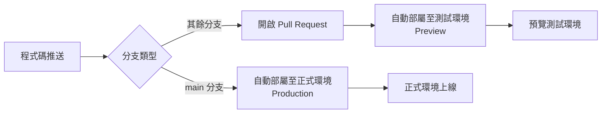

# Member API Frontend

SvelteKit 前端專案

## 環境需求

- linux OR macOS
- Node.js 20+
- npm
- just (recommended)

## gitflow

## 部屬策略

部屬依賴在 Vercel 平台上，採用自動化部屬策略。

| 分支     | 部屬環境   | 觸發條件          |
| -------- | ---------- | ----------------- |
| main     | Production | 推送至 main 分支  |
| 其餘分支 | Preview    | 開啟 Pull Request |
